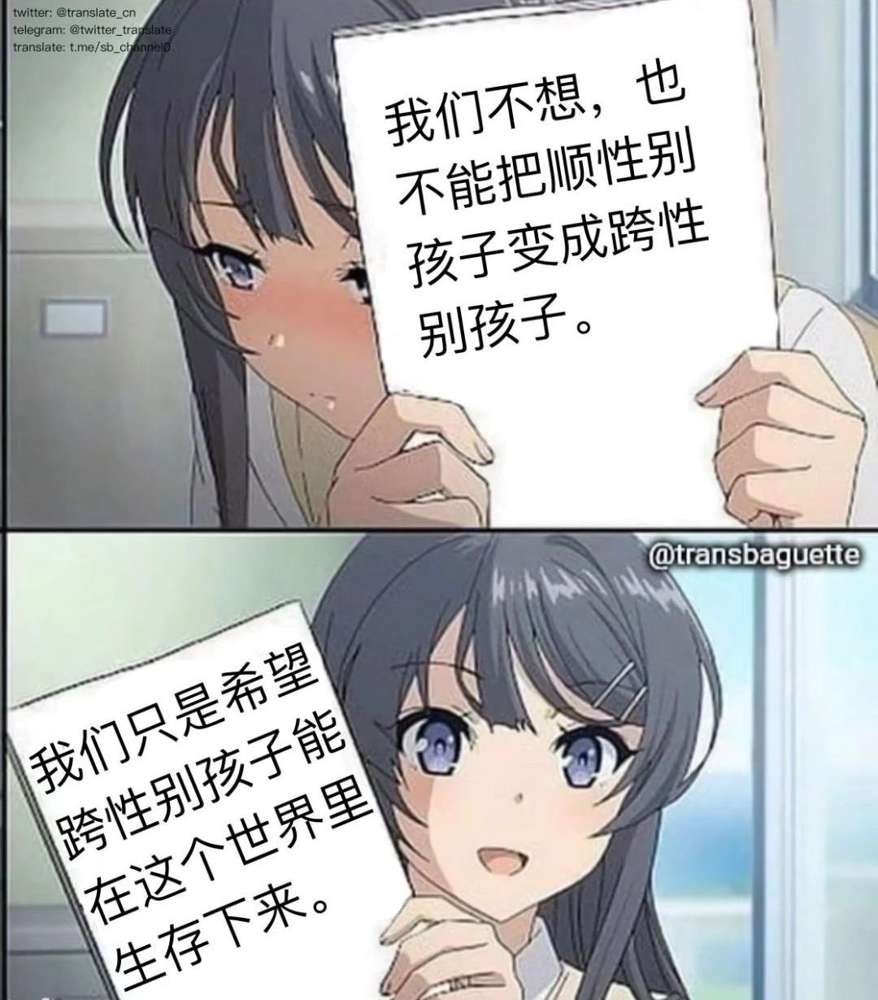

# 武汉天街杀人案

<!-- 备份使用 the web archive wayback machine，大陆访问可能需要推倒墙娘 -->

刚才找到一个讲这件事情的[文章](https://kit.turbohk.cc/?p=334) ([备份](https://web.archive.org/web/20220313055519/https://kit.turbohk.cc/?p=334))

> \[以下节选自以上文章\] 
> 
> 昨日妇女节翌日，在武汉天街，有一位穿着女装的跨性别女性，因为中国法律及社会舆论而被迫进入男厕所，但被一名素不相识、仇视跨性别的男性，对他发起口角，又一刀捅向死者。图片显示受害的跨女身上大量流血、全身躺在商场。只是被迫进男厕的她，在最后时刻被扒光衣服羞辱着，与被素不相识的反跨男路人、当街残忍杀害。

[另一个](https://www.antcaijing.com/article/2260.html) ([备份](https://web.archive.org/web/20220313060019/https://www.antcaijing.com/article/2260.html))

> \[以下节选自以上文章\] 
> 
> 案發當天，商場人來人往。有目擊者在下午4時許透過聊天羣組指出：「天街有個女的被殺了，好嚇人，在商場裡面廁所，衣服都被脫了。」流傳的案發現場照片可見，倒在血泊裡的死者身穿女裝與過膝長靴，因此她的身分被推斷是跨性別（Transgender）女性，基於生理性別使用男廁卻遭遇不測。
> 
> 一名呼籲關注此案的跨性別網友「麗茲馬璐璐」10日在微博發文指出，接到了武漢警方的電話，「由於嫌疑人作案行為過於惡劣，場景十分血腥，嫌疑人已經被當場抓獲且還在審訊作案動機中，所以為了避免對受害人家屬的影響，以及影響警方案件的偵查工作，目前已經將之前那條微博刪除，請大家耐心等待警方的通告。」

---

## 事件

> 情况报告：3月9日17时30分接区部门报告，
> 15时45分江辰天街发生一起持刀伤人事件。
> 部门已将嫌疑人张某成（男，19岁，江汉区人）控制，并正在进行讯问，案件正在进一步办理之中。
> 案件现场一名男性伤者罗某 （男 [跨性别女]，21岁，恩施人）躺在地上，后经120确认
伤者已死亡。
>
> 初步了解，今天下午在汉口范湖江宸天街综合体4楼一男厕所内，
> 犯罪嫌疑人与同在厕所内的受害人(室内餐厅蒸鲜员工)产生口角后(两人并不认识)，
> 导致出现暴力流血冲突。
> 目前犯罪嫌疑人已被江汉分局抓获。
>
> 

[Source](https://twitter.com/TRANS_MIZUKI/status/1501802653566869504)

---

## 评论

> 高度怀疑嫌疑人在厕所里欺辱或调戏被害人，被害人奋起反抗，嫌疑人一怒之下动手杀人。
> 之后，嫌疑人为了脱罪，在警方面前声称因起口角而激情杀人。
> [\*](https://twitter.com/realtanitsuki/status/1501845242600775681?s=12)

> 怪不得被壓消息了、、
> 性少數和慘烈的謀殺案都是不能出現在中國「一片祥和」的官制公共輿論場上的，所以乾脆捂住大眾的眼睛，仿佛事情從未發生過。
> 效果很好，牆內網絡公共空間的相關討論寥寥，輿情管控又一次勝利了。
> [\*](https://twitter.com/KMarin2005/status/1501811087494156293)

> 不管杀的男人还是女人，起码她是个人吧，也有生存的权利吧。其他人没有权利去决定别人生死更没有资格去杀人。杀人就是犯法，任何人也不能凌驾于法律之上！触犯法律的人都应该得到严惩！如果这都不处理，那墙内的风景线可真是美丽动人呢
> [\*](https://twitter.com/ChiyokoKumiNeko/status/1501856544597901321)

> 我不想被人扒光衣服捅死在街上... 尤其是在天朝的街上...
> [\*](https://twitter.com/sakurazawaryoko/status/1501883154352599044?s=21)

> 再加上看到那个贴吧囚禁mtf的帖子
> 我们究竟为什么要承受来自整个社会的恶意呢？
> 仅仅是我们没有选择“正常”的生活而去追寻真正的自己嘛？
> “不是在沉默中爆发 就是在沉默中死亡”
> 但是墙内的平台会帮你闭嘴 让你沉默
> 至少我们每个人应该记住她的名字…
> [\*](https://twitter.com/Ayane014081/status/1501927387944321030)

> R.I.P 愿她下辈子一定是美少女……

> 

---

刚才在百度搜了一下，发现完全没有任何媒体讲这件事，也没有官方的回应。
认为这件事不应该被如此忽视，于是建立了这个repo，整理一下所有社交软件上与本事件有关的信息。

如果有更多关于本事件的信息欢迎在`discussions`中发出来
